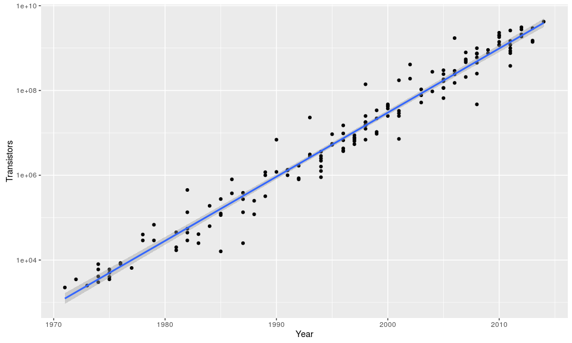
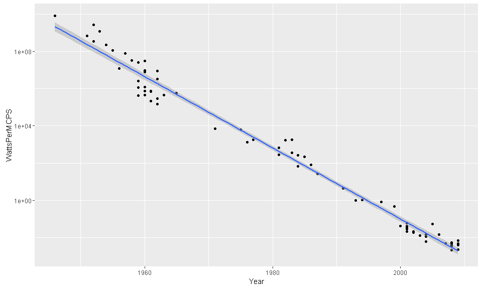
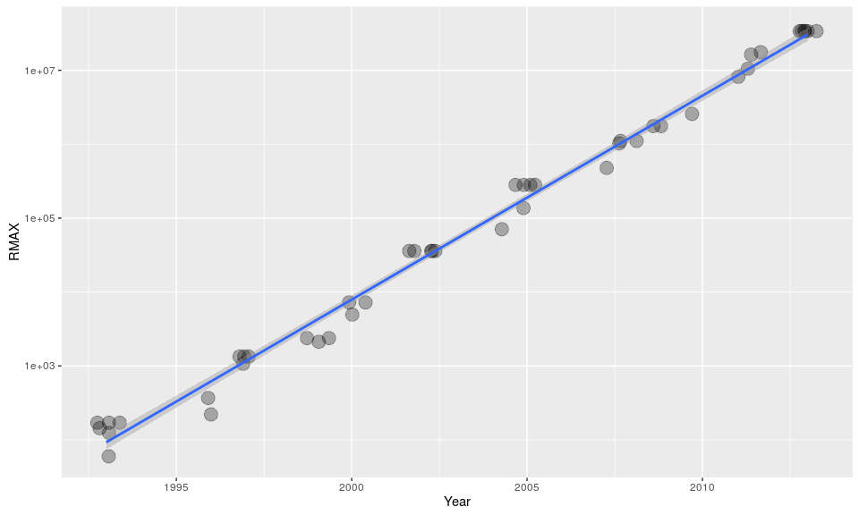
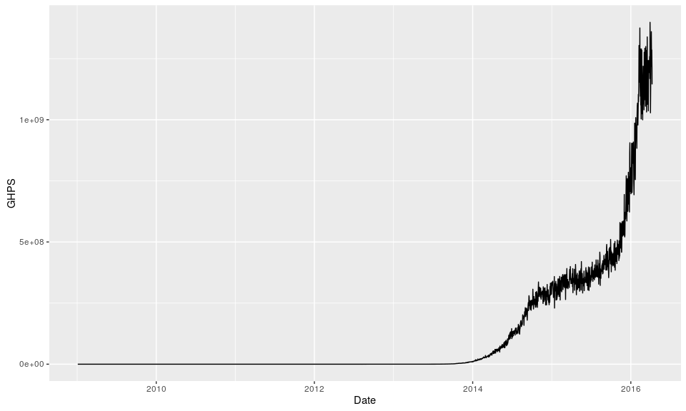

An R Package of datasets to help predict the creation of Artificial General Intelligence.

Installation
------------

``` r
devtools::install_github("aaboyles/AIPredict")
```

Data
----

This package contains the following datasets:

-   `ai_moores_law` - contains observations contributing to estimates of Moore's law.
-   `ai_koomeys_law` - contains observations contributing to estimates of Koomey's law. Derived from the dataset constructed by Jonathan Koomey, which is aarchived in the `data-raw/` directory.
-   `ai_prediction` - contains public estimates of Artificial Intelligence milestones. Derived from the dataset produced by [AI Impacts](http://aiimpacts.org/miri-ai-predictions-dataset/), which is archived in the `data-raw/` directory.
-   `ai_bitcoin_hashrate` - contains the instantaneous hashrate of the bitcoin network measured daily at 6:15:05pm UTC.
-   `ai_fli_winners` - contains the published data of the winners of the Future of Life Institute's 2015 RFP for grants on research for safe artificial intelligence.
-   `ai_animal_neurons` - contains the merged tables in the Wikipedia Article, [List of Animals by Number of Neurons](https://en.wikipedia.org/w/index.php?title=List_of_animals_by_number_of_neurons&oldid=710786267)

### Moore's Law

Roughly stated, Moore's law predicts that the density of transistors in a single processor core grows exponentially. (Moore and Fellow 1998) It is a widely used and cited metric in predictions about the development of Artificial General Intelligence.

``` r
library(AIPredict)
library(dplyr)
library(ggplot2)

ai_moores_law %>%
  ggplot(aes(Year, Transistors)) +
  geom_point() +
  scale_y_log10() +
  stat_smooth(method="lm")
```

<!-- -->

### Koomey's Law

Koomey's law states that the electricty required to execute some number of computations declines exponentially over time (Koomey et al. 2011). Every decade, the energy cost of computing falls approximately two orders of magnitude.

``` r
ai_koomeys_law %>%
  ggplot(aes(Year, WattsPerMCPS)) +
  geom_point() +
  scale_y_log10() +
  stat_smooth(method="lm")
```

<!-- -->

While less well-known than Moore's law, it offers another critical benchmark for comparison to the human brain.

### Bitcoin Hashrate

The Hashrate of the Bitcoin network provides a useful insight into the growth of financially-motivated expenditure of computing resources. I suspect that this will be a useful point of comparison as the network's exercised capacity approaches levels comparable to the the human brain.

``` r
ai_bitcoin_hashrate %>%
  ggplot(aes(Date, GHPS)) +
  geom_line()
```

<!-- -->

### Animal Brains

This dataset isn't especially reliable. It was scraped from the [tables of wikipedia](https://en.wikipedia.org/w/index.php?title=List_of_animals_by_number_of_neurons&oldid=710786267).

``` r
ai_animal_neurons %>%
  ggplot(aes(Neurons, Synapses)) +
  geom_point() +
  scale_y_log10() +
  scale_x_log10()
```

    Warning: Removed 47 rows containing missing values (geom_point).

<!-- -->

The logarithmic scale in both dimensions suggests a power-law relationship, but this is derived from a very small, very noisy sample.

Desired Data
------------

This notably misses estimates about the computational capacities of the biological brains. Other types of estimates about the growth of computing power (e.g. global computing power, specs on the most powerful supercomputer at any given time, size of various commercial cloud infrastructure providers, etc.) are also needed. If you know of any reliable sources of these or related to these topics, please [email me](anthony@boyles.cc).

References
----------

Koomey, J G, S Berard, M Sanchez, and H Wong. 2011. “Implications of Historical Trends in the Electrical Efficiency of Computing.” *IEEE Annals of the History of Computing* 33 (3): 46–54. doi:[10.1109/MAHC.2010.28](https://doi.org/10.1109/MAHC.2010.28).

Moore, Gordon E, and Life Fellow. 1998. “Cramming More Components onto Integrated Circuits.” *Proceedings of the IEEE* 86 (1). <http://www.cs.utexas.edu/~fussell/courses/cs352h/papers/moore.pdf>.
