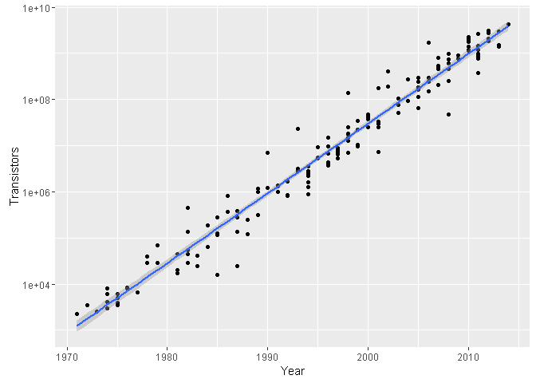

An R Package of datasets to help predict the creation of Artificial General Intelligence.

Installation
------------

``` r
devtools::install_github("aaboyles/AIPredict")
```

Data
----

This package contains three datasets:

-   `ai_moores_law` - contains observations contributing to estimates of Moore's law.
-   `ai_koomeys_law` - contains observations contributing to estimates of Koomey's law. Derived from the dataset constructed by Jonathan Koomey, which is aarchived in the `data-raw/` directory.
-   `ai_prediction` - contains public estimates of Artificial Intelligence milestones. Derived from the dataset produced by [AI Impacts](http://aiimpacts.org/miri-ai-predictions-dataset/), which is archived in the `data-raw/` directory.

Demo
----

``` r
library(AIPredict)
library(dplyr)
library(ggplot2)

ai_moores_law %>%
  ggplot(aes(Year, Transistors)) +
  geom_point() +
  scale_y_log10() +
  stat_smooth(method="lm")
```

<!-- -->

Desired Data
------------

This notably misses estimates about the computational capacities of the human brain. Other types of estimates about the growth of computing power (e.g. estimates of global computing power, specs on the most powerful supercomputer at any given time, size of various commercial cloud infrastructure providers, hashrate of the bitcoin network, etc.)

If you know of any reliable sources of or related to these topics, please [email me](anthony@boyles.cc).
