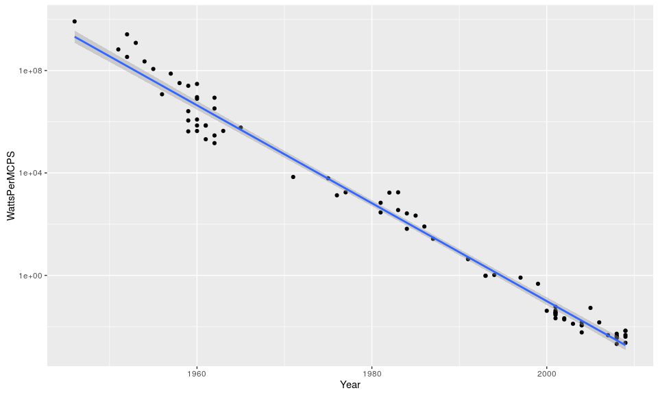

An R Package of datasets to help predict the timeline preceding an Intelligence Explosion.

Installation
------------

``` r
install.packages("https://github.com/AABoyles/AIPredict/archive/master.tar.gz", type = "source")
```

Data
----

This package contains the following datasets:

-   `ai_moores_law` - contains observations contributing to estimates of Moore's law.
-   `ai_koomeys_law` - contains observations contributing to estimates of Koomey's law. Derived from the dataset constructed by Jonathan Koomey, which is aarchived in the `data-raw/` directory.
-   `ai_prediction` - contains public estimates of Artificial Intelligence milestones. Derived from the dataset produced by [AI Impacts](http://aiimpacts.org/miri-ai-predictions-dataset/), which is archived in the `data-raw/` directory.
-   `ai_bitcoin_hashrate` - contains the instantaneous hashrate of the bitcoin network measured daily at 6:15:05pm UTC.
-   `ai_animal_neurons` - contains the merged tables in the Wikipedia Article, [List of Animals by Number of Neurons](https://en.wikipedia.org/w/index.php?title=List_of_animals_by_number_of_neurons&oldid=710786267)
-   `ai_fli_winners` - contains the published data of the winners of the Future of Life Institute's 2015 RFP for grants on research for safe artificial intelligence.

### Moore's Law

Roughly stated, Moore's law predicts that the density of transistors in a single processor core grows exponentially. (Moore and Fellow 1998) It is a widely used and cited metric in predictions about the development of Artificial General Intelligence. Perhaps the best-known of these is futurist Ray Kurzweil's projections in The Singularity is Near (2005), which are based on simple, linear extrapolations of Moore's law.

``` r
library(AIPredict)
library(dplyr)
library(ggplot2)

ai_moores_law %>%
  ggplot(aes(Year, Transistors)) +
  geom_point() +
  scale_y_log10() +
  stat_smooth(method="lm")
```

<!-- -->

### Koomey's Law

Koomey's law states that the electricty required to execute some number of computations declines exponentially over time (Koomey et al. 2011). While less well-known than Moore's law, it offers another critical benchmark for comparison to the human brain, which computes a mind on a metabolic budget of approximately 10 watts.

``` r
ai_koomeys_law %>%
  ggplot(aes(Year, WattsPerMCPS)) +
  geom_point() +
  scale_y_log10() +
  stat_smooth(method="lm")
```

<!-- -->

Every decade, the energy cost of computing falls approximately two orders of magnitude.

### Top 500 Supercomputers

The Top 500 Supercomputers. Another good source for demonstrating Moore's and Koomey's laws.

``` r
ai_top500 %>%
  filter(Rank == 1) %>%
  mutate(RMAX=ifelse(is.na(RMax), Rmax, RMax)) %>%
  filter(!is.na(RMAX)) %>%
  ggplot(aes(Year, RMAX)) +
  geom_jitter(width = 1, height = 0, alpha=.3, size=5) +
  scale_y_log10() +
  stat_smooth(method = "lm")
```

<!-- -->

While generally accessible, these data currently require a good deal of cleaning, which I'll perform and document in due course.

### Bitcoin Hashrate

The Hashrate of the Bitcoin network provides a useful insight into the growth of financially-motivated expenditure of computing resources to compute the solution of a single problem. I suspect that this will be a useful point of comparison as the network's exercised capacity approaches levels comparable to the the human brain.

``` r
ai_bitcoin_hashrate %>%
  ggplot(aes(Date, GHPS)) +
  geom_line()
```

<!-- -->

### Animal Brains

As our computational capacity climbs through the ranks of the animal kingdom, there are a variety of metrics which would be useful for comparison. The [Number of Neurons, Cortical Neurons (in mammals), Synapses](https://en.wikipedia.org/wiki/List_of_animals_by_number_of_neurons), [Brain size](https://en.wikipedia.org/wiki/Brain_size), [Brain-to-Body Mass Ratio](https://en.wikipedia.org/wiki/Brain-to-body_mass_ratio), [Encephalization Quotient](https://en.wikipedia.org/wiki/Encephalization_quotient) and [Cranial Capacity](https://en.wikipedia.org/wiki/Brain_size#Cranial_capacity) might all be useful in this line of research. Sadly, I've not yet found any sources (let alone reliable ones) for more than a few species. This dataset was scraped from the [Wikipedia's List of Animals by Number of Neurons](https://en.wikipedia.org/w/index.php?title=List_of_animals_by_number_of_neurons&oldid=710786267).

``` r
ai_animal_neurons %>%
  ggplot(aes(Neurons, Synapses)) +
  geom_point() +
  scale_y_log10() +
  scale_x_log10() +
  stat_smooth(method = "lm")
```

    Warning: Removed 47 rows containing non-finite values (stat_smooth).

    Warning: Removed 47 rows containing missing values (geom_point).

<!-- -->

The logarithmic scale in both dimensions suggests a [power-law relationship](https://en.wikipedia.org/wiki/Power_law), but this is derived from a very small, very noisy sample.

### Future of Life Institute Winning Grants

I don't know if there's anything interesting to be inferred from the [Future of Life Institute Grant Recipients](http://futureoflife.org/first-ai-grant-recipients/), but I collected this data when it was first published and this seems as appropriate a venue as any for its dissemination.

``` r
ai_fli_winners %>%
  group_by(Institution) %>%
  summarise(Total = sum(Amount)) %>% 
  ggplot(aes(Institution, Total)) +
  geom_bar(stat = "identity") +
  theme(axis.text.x = element_text(angle=90, hjust = 1))
```

<!-- -->

Data to be added
----------------

This is an obviously incomplete project. Besides the sources demonstrated above, I have the following known sources to be prepared use in this package:

-   The Graph 500 (“Brief Introduction,” n.d.)
-   Cellular scaling rules for primate brains (Herculano-Houzel et al. 2007)

### Desired Data

This notably misses estimates about the computational capacities of the biological brains. Other types of estimates about the growth of computing power (e.g. global computing power, specs on the most powerful supercomputer at any given time, size of various commercial cloud infrastructure providers, etc.) are also needed. If you know of any reliable sources of these or related to these topics, please [email me](anthony@boyles.cc).

References
----------

“Brief Introduction.” n.d. <http://www.graph500.org/>. <http://www.graph500.org/>.

Herculano-Houzel, Suzana, Christine E Collins, Peiyan Wong, and Jon H Kaas. 2007. “Cellular Scaling Rules for Primate Brains, Table 2.” <http://www.pnas.org/content/104/9/3562/suppl/DC1>.

Koomey, J G, S Berard, M Sanchez, and H Wong. 2011. “Implications of Historical Trends in the Electrical Efficiency of Computing.” *IEEE Annals of the History of Computing* 33 (3): 46–54. doi:[10.1109/MAHC.2010.28](https://doi.org/10.1109/MAHC.2010.28).

Kurzweil, Ray. 2005. *The Singularity Is Near: When Humans Transcend Biology*. Penguin. <https://books.google.com/books?hl=en&lr=&id=9FtnppNpsT4C&oi=fnd&pg=PT22&dq=The%2BSingularity%2Bis%2BNear&ots=K29jXGYYAz&sig=wWisXrrCfssdSBBEGDMAsjgPrBk>.

Moore, Gordon E, and Life Fellow. 1998. “Cramming More Components onto Integrated Circuits.” *Proceedings of the IEEE* 86 (1). <http://www.cs.utexas.edu/~fussell/courses/cs352h/papers/moore.pdf>.

Wikipedia contributors. 2016. “List of Animals by Number of Neurons.” <https://en.wikipedia.org/w/index.php?title=List_of_animals_by_number_of_neurons&oldid=716197676>. <https://en.wikipedia.org/w/index.php?title=List_of_animals_by_number_of_neurons&oldid=716197676>.
